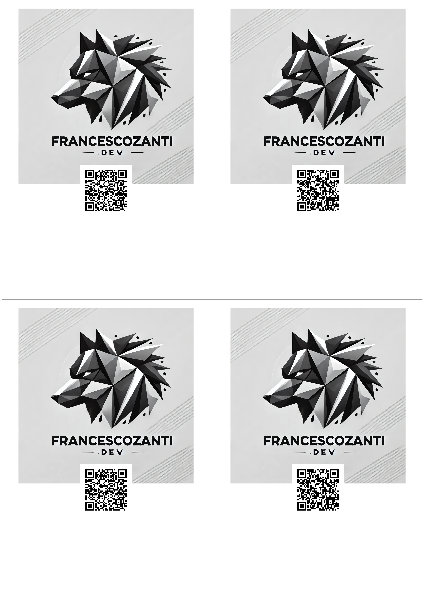

## Genos-A-QR-Code-Serial-Generator 

### Panoramica
Questo progetto è stato realizzato per automatizzare la creazione di adesivi con QR Code differenti. 
Il template dell'adesivo è customizzabile; è possibile compilare il file seriali.txt con un valore differente per ogni QR Code.

### Installazione
Per installare il progetto, seguire questi passaggi:
1. Clonare il repository: `git clone https://github.com/FrancescoZanti/Genos---A-QR-Code-Serial-Generator.git Genos`
2. Navigare nella directory del progetto: `cd Genos`
3. Installare le dipendenze: `pip install -r requirements.txt`

### Utilizzo
Per utilizzare il progetto, seguire questi passaggi:
1.  Compilare il file "seriali.txt" con un valore (numero, URL) diverso per ogni riga
2.  Avviare lo script `python main.py`
3.  Visionare il risultato nella cartella "adesivi_output"

<figure>

<figcaption> Esempio adesivo A6 </figcaption>
</figure>
<br>
<figure>

<figcaption> Esempio adesivo A4 preformato </figcaption>
</figure>

### Utilizzo con Podman

Prima creare l'immagine:

````bash

podman build -f Containerfile -t genos:latest

````

Successivamente avviare il container e attendere l'esecuzione

````bash

podman run --rm  -v $(pwd)/adesivi_output/:/app/adesivi_output:Z -v $(pwd)/seriali.txt:/app/seriali.txt:Z genos:latest

````

### Feature sviluppate

- Possibilità di avere più adesivi preformati in un foglio A4 per semplificare le operazioni di stampa
- Creazione di immagine per container

### Contributi
Accogliamo con favore i contributi! Per contribuire, seguire questi passaggi:
1. Fare un fork del repository
2. Creare un nuovo branch: `git checkout -b [nome del branch]`
3. Apportare le modifiche
4. Inviare la PR per verificare la compatibilità